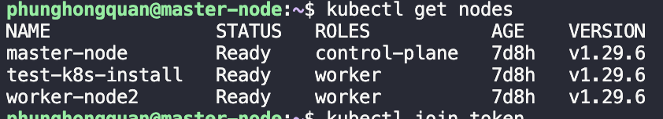

# installation_documentation

This is repo provides the complete installation guide for applications, probably bugs fix during installing process. \

The OS using in this process is Ubuntu 20.04(LTS)

## Docker

The installation process mostly refer to this [Docker installtion]

### Install Docker using shell script

```sh
chmod +x docker.sh
./docker.sh
```

#### Change the default cgroup to from `cgroupfs` to `systemd`

```sh
sudo mkdir -p /etc/docker
sudo tee /etc/docker/daemon.json <<EOF
{
  "exec-opts": ["native.cgroupdriver=systemd"],
  "log-driver": "json-file",
  "log-opts": {
    "max-size": "100m"
  },
  "storage-driver": "overlay2"
}
EOF
```

#### Reload the daemon and docker

```sh
sudo systemctl enable docker
sudo systemctl daemon-reload
sudo systemctl restart docker
```

#### Turn of swap

```sh
# find the line with swap and comment it
sudo nano /etc/fstab

#reboot if necessary
sudo reboot
```

#### Turn of firewall

**This is not recommend because of security problems.** \
In production environment, open only neccesary ports of K8s, refer to this [K8s port requirement]

```sh
sudo ufw disable
```

### Confirm the installation

After rebooting the system should meet the following condition

- swap is `turned off`
- the default cgroup is `systemd`
- firewall is `turned off`
#### Check if swap is turned off

```sh
# the line for swap should be all 0
free -h
```

#### Check if default cgroup is systemd

```sh
sudo docker info | grep -i cgroups
```

You should see something like this

> Cgroup Driver: systemd \
> Cgroup Version: 1

#### Check if firewall is off
```sh
sudo ufw status
```

## K8s

The setup include 1 Master node and 2 Worker node
Recommended hardware requirement for each Master and Worker nodes are: \
`CPU`: 2 cores \
`RAM`: 4GB \
`SSD`: 40GB

### Installing using shell script

```sh
chmod +x k8s_install.sh
./k8s_install.sh
```

### Install Helm

```sh
chmod +x helm_installation.sh

# run the script
./helm_installation.sh
```

### Enable CNI(Container Network Interface)

```sh
# comment the only line in the file
sudo vi /etc/containerd/config.toml

# restart the container runtime
sudo systemctl restart containerd
```

### Initialize the cluster

```sh
sudo kubeadm init --pod-network-cidr=192.168.0.0/16 --apiserver-advertise-address=<MASTER_IP>
```

The Master_IP refer to the internal IP of the server, use `ip route show` to view.

### Create directory for the cluster(for the Master Node)

```sh
mkdir -p $HOME/.kube
sudo cp -i /etc/kubernetes/admin.conf $HOME/.kube/config
sudo chown $(id -u):$(id -g) $HOME/.kube/config
```

Once finished initialize save the output for later join with the Worker Node

### Install CNI plugin(we use Calico)

```sh
chmod +x calico_installation

# run the script
./calico_installation.sh
```

### Setup on Worker Node

Repeat Step1 [Install using script](#install-using-shell-script) and Step2 [Enable CNI](#enable-cnicontainer-network-interface) on every Worker Node

### Join the Worker Node to the cluster

Assume this is the join token you get after initializing the cluster

```sh
kubeadm join 10.128.0.7:6443 --token 5ngv5u.faso7ed9s8gxxxxx --discovery-token-ca-cert-hash sha256:a114ae227988bc82aac8abae7c2ee932584dfcca295577aeb0212d6c3xxxxxxx
```

Copy and run the whole thing on every Worker Node

### Verify the initialization

On the Master node, run:
`kubectl get nodes` and you should see something like this:


###

## References

[Docker installtion]: https://docs.docker.com/engine/install/ubuntu/
[K8s installation]: https://v1-29.docs.kubernetes.io/docs/setup/production-environment/tools/kubeadm/install-kubeadm/
[K8s port requirement]: https://kubernetes.io/docs/reference/networking/ports-and-protocols/
[Helm installation]: https://helm.sh/docs/intro/install/
[Calico installation]: https://docs.tigera.io/calico/latest/getting-started/kubernetes/helm
