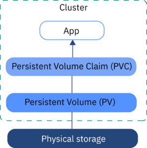

## Jupyterhub

This guide refers to this [Jupyterhub installtion] \
This installation using Jupyterhub chart version 3.3.7 which equavilent to Jupterhub App Version 4.1.5. Refering to this [document](https://hub.jupyter.org/helm-chart/) for releases.

## Yêu cầu hệ thống

Helm: v3.15 \
kubectl: v1.26 \
kubeadm: v1.26 \
kubelet: v1.25 \
Calico: v3.28.0

Nếu hệ thống chưa có những dịch vụ trên thì refer tới tài liệu hướng dẫn cài đặt này: \
[Cài đặt Helm, kubectl, kubeadm, kubelet, Calico](../k8s/k8s.md)

## Giải thích về PVC, PV và StorageClass

### PVC

- PV là một khối lưu trữ được quản lý bởi cụm Kubernetes. Nó là tài nguyên lưu trữ thực tế có thể tồn tại lâu dài và có thể được sử dụng bởi các ứng dụng trong cụm.
- PV có thể được cung cấp bằng nhiều cách khác nhau như NFS, iSCSI, cloud storage service như Amazon EBS, Google Persistent Disk,... \
- PV có 4 chế độ truy cập (ReadWriteOnce, ReadOnlyMany, ReadWriteMany).

### PVC

- PVC là cách mà service yêu cầu cụm cung cấp không gian lưu trữ.
- Một số dịch vụ khi được khởi tạo sẽ yêu cầu một không gian lưu trữ. Cụm sẽ cung cấp không gian lưu trữ thông qua PV.

## StorageClass

- StorageClass là không gian lưu trữ vật lý(Physical Storage)

- StorageClass chứa thông tin về driver lưu trữ, thông số cấu hình, và các thông tin khác cần thiết để tạo PV. Ví dụ, một StorageClass có thể định nghĩa rằng tất cả các PV được tạo ra sẽ là ổ cứng SSD với một kích thước cụ thể.

<div style="text-align:center;">
  
</div>

## Cài đặt Jupyterhub

### Add Jupyterhub to Helm repo

```sh
helm repo add jupyterhub https://hub.jupyter.org/helm-chart/
helm repo update
```

### Create config file

```sh
#!/bin/bash
# config.yaml

singleuser:
  storage:
    type: static # có 2 mode: static và dynamic
    static:
      pvcName: hub-db-dir # tên của PVC
      subPath: "{username}"
    capacity: 50Gi
    homeMountPath: /home/aircadm # thư mục Jupyterhub sẽ lưu dữ liệu
hub:
  config:
    JupyterHub:
      admin_access: true
      authenticator_class: dummy
    KubeSpawner:
      start_timeout: 100
      http_timeout: 100
    Spawner:
      args: ['--allow-root'] # cấp quyền cho Spawner
  db:
    type: sqlite-pvc
    upgrade:
    pvc:
      annotations: {}
      selector: {}
      accessModes:
        - ReadWriteOnce
      storage: 50Gi
      subPath:
      storageClassName: hostpath

debug:
  enabled: true
```

### Tạo StorageClass

```sh
#!/bin/bash
# storageClass.yaml

apiVersion: storage.k8s.io/v1
kind: StorageClass
metadata:
  name: hostpath # trùng với PV
provisioner: kubernetes.io/no-provisioner # nôm na là ko dùng cloud service
volumeBindingMode: WaitForFirstConsumer
```

### Tạo PV(Persistent Volume)

```sh
#!/bin/bash
#hub-db-dir-pv.yaml

apiVersion: v1
kind: PersistentVolume
metadata:
  name: hub-db-dir-pv
  labels:
    type: local
spec:
  storageClassName: hostpath # trùng với storageClassName trong PV
  capacity:
    storage: 50Gi
  volumeMode: Filesystem # Là lưu Local
  accessModes:
    - ReadWriteOnce
  persistentVolumeReclaimPolicy: Retain  # Or Delete, Recycle based on your preference
  hostPath:
    path: /mnt/data/jupyterhub  # đảm bảo là đường dẫn này đều có trên tất cả các node
```

### Tạo PVC(Persisten Volume Claim)

```sh
#!bin/bash
#hub-db-dir-pvc.yaml

apiVersion: v1
kind: PersistentVolumeClaim
metadata:
  name: hub-db-dir
  namespace: jupyterhub
spec:
  accessModes:
    - ReadWriteMany
  resources:
    requests:
      storage: 3Gi
  storageClassName: hostpath
  volumeName: hub-db-dir-pv
```

### Cấp quyền cho các thư mục

Ở trong file hub-db-dir-pv.yaml có một trường thuộc tính

```sh
hostPath.path: mnt/data/jupyterhub
```

Đây là vị trí mà database sẽ được thiết lập, vì thì cần cấp `Ownership` và `Permission` cho Jupterhub tới folder đó.

```sh
# Cấp Ownership và Permision trên tất cả các node
sudo chown -R 1000:1000 /mnt/data/jupyterhub
sudo chmod -R 755 /mnt/data/jupyterhub
```

### Install Jupterhub

```sh
helm upgrade --cleanup-on-fail \
  --install jupyterhub-release jupyterhub/jupyterhub \
  --namespace jupyterhub \
  --create-namespace \
  --version=3.3.7 \
  --values config.yaml
```

## Reference

[Jupyterhub installtion]: https://z2jh.jupyter.org/en/latest/jupyterhub/installation.html
