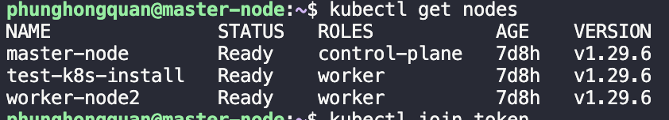

# K8s

The setup include 1 Master node and 2 Worker node
Recommended hardware requirement for each Master and Worker nodes are: \
`CPU`: 2 cores \
`RAM`: 4GB \
`SSD`: 40GB

## Setup on Master node

### Create firewall rule for master

```sh
chmod +x master_firewall.sh

# run the script
./master_firewall.sh
```

### Install using shell script

```sh
chmod +x k8s_install.sh
./k8s_install.sh
```

### Install Helm

```sh
chmod +x helm_installation.sh

# run the script
./helm_installation.sh
```

### Enable CNI(Container Network Interface)

```sh
# comment the only line in the file
sudo vi /etc/containerd/config.toml

# restart the container runtime
sudo systemctl restart containerd
```

### Initialize Cluster

```sh
sudo kubeadm init --pod-network-cidr=192.168.0.0/16 --apiserver-advertise-address=<MASTER-IP>
```

The Master-IP refer to the internal IP of the server, use `ip route show` to view.

Once finished initialize save the output for later join with the Worker Node

### Create directory for the cluster(for the Master Node)

```sh
mkdir -p $HOME/.kube
sudo cp -i /etc/kubernetes/admin.conf $HOME/.kube/config
sudo chown $(id -u):$(id -g) $HOME/.kube/config
```

### Install CNI plugin(we use Calico)

```sh
chmod +x calico_installation.sh

# run the script
./calico_installation.sh
```

## Setup on Worker Node

### Setup firewall rule for Worker node

```sh
chmod +x worker_firewall.sh

# run the script
./worker_firewall.sh
```

Repeat Step1 [Install using script](#installing-using-shell-script) and Step2 [Enable CNI](#enable-cnicontainer-network-interface) on every Worker Node

### Join the Worker Node to the cluster

Assume this is the join token you get after initializing the cluster

```sh
kubeadm join 10.128.0.7:6443 --token 5ngv5u.faso7ed9s8gxxxxx --discovery-token-ca-cert-hash sha256:a114ae227988bc82aac8abae7c2ee932584dfcca295577aeb0212d6c3xxxxxxx
```

Copy and run the whole thing on every Worker Node

### Verify the initialization

On the Master node, run:
`kubectl get nodes` and you should see something like this:



## References

[K8s installation]: https://v1-29.docs.kubernetes.io/docs/setup/production-environment/tools/kubeadm/install-kubeadm/
[K8s port requirement]: https://kubernetes.io/docs/reference/networking/ports-and-protocols/
[Helm installation]: https://helm.sh/docs/intro/install/
[Calico installation]: https://docs.tigera.io/calico/latest/getting-started/kubernetes/helm
